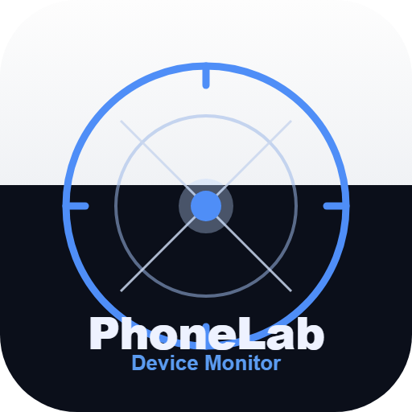
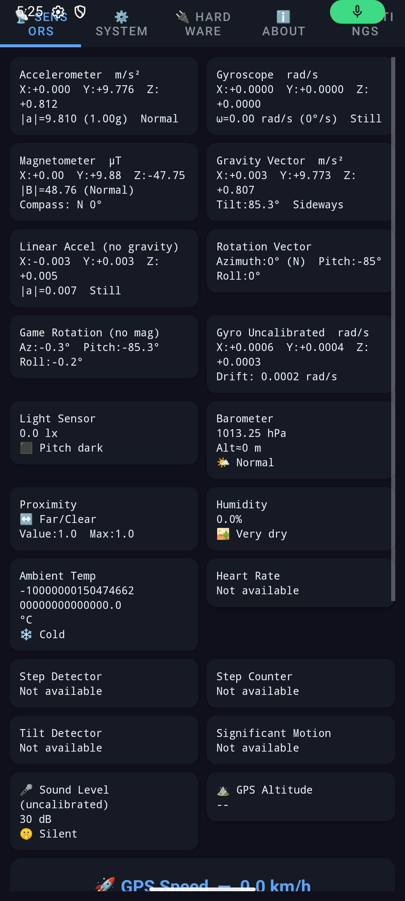
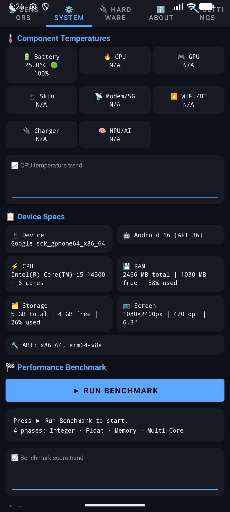
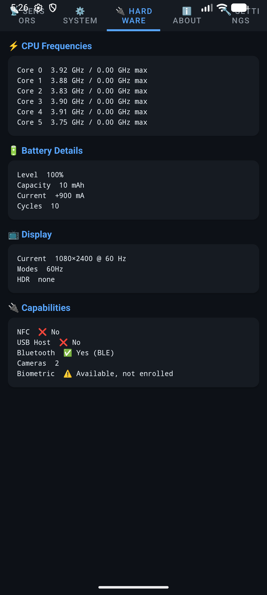
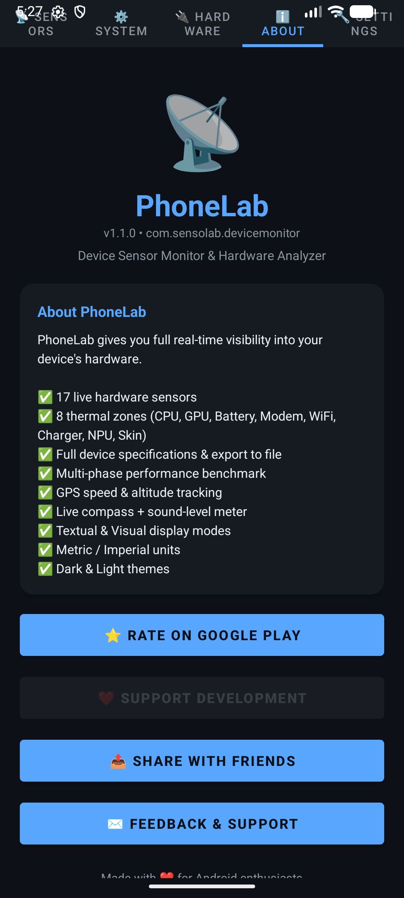
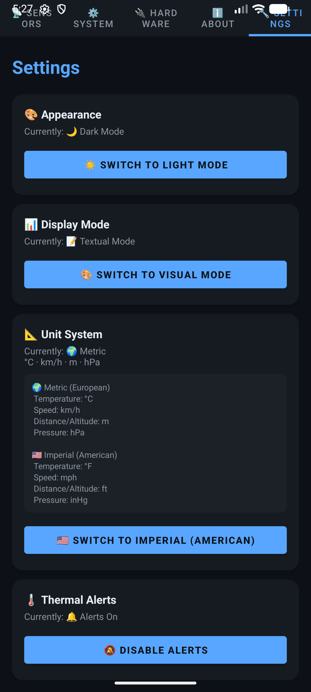

<div align="center">



# PhoneLab

[](https://github.com/DrummingBird1/PhoneLab/actions/workflows/android-ci.yml)
[](https://github.com/DrummingBird1/PhoneLab/releases/latest)

**اقرأ بلغة أخرى:** [English](README.md) · [עברית](README.he.md) · [Español](README.es.md) · العربية

[**⬇ تنزيل أحدث ملف APK**](https://github.com/DrummingBird1/PhoneLab/releases/latest) · [الموقع الإلكتروني](https://drummingbird1.github.io/PhoneLab/) · [سياسة الخصوصية](https://drummingbird1.github.io/phonelab-privacy/)

</div>

<div dir="rtl" align="right">

---

## ما هو PhoneLab؟

**PhoneLab** هو تطبيق أندرويد بشاشة واحدة لأي شخص يريد أن يعرف بالضبط ما تفعله عتاد جهازه الآن — المطورون الذين يختبرون سلوك المستشعرات، وعشّاق التقنية، ولاعبو الألعاب الذين يراقبون درجة حرارة المعالج، أو أي شخص فضولي حول ما بداخل هاتفه.

بلا إعلانات. بلا حساب مستخدم. بلا خدمات تعمل في الخلفية عندما لا تستخدم التطبيق. التطبيق لا يقرأ سوى المستشعرات وملفات النظام التي يمكن لأي تطبيق أندرويد الوصول إليها أصلًا — وهو **لا يتصل بالإنترنت أبدًا**. التفاصيل الكاملة في [سياسة الخصوصية](https://drummingbird1.github.io/phonelab-privacy/).

## لقطات الشاشة

<div align="center">





</div>

## الميزات

**📡 تبويب المستشعرات** — قراءات حية من نحو 29 مستشعرًا (مقياس التسارع، الجيروسكوب، المغناطيسية، الجاذبية، متجهات الدوران، الضغط الجوي، الإضاءة، القرب، الرطوبة، درجة حرارة المحيط، نبض القلب، عداد الخطوات، كواشف الميل والحركة، والمزيد)، بالإضافة إلى سرعة GPS ومقياس مستوى الصوت الحي. توفر المستشعرات يختلف حسب الجهاز — يوضح التطبيق بجلاء ما لا يتوفر في عتادك.

**⚙️ تبويب النظام** — طراز الجهاز، إصدار أندرويد، المعالج/الذاكرة/التخزين، درجات حرارة المناطق الحرارية (المعالج/معالج الرسوميات/البطارية/الهيكل وغيرها) مع تنبيهات ملوّنة، اختبار أداء من 4 مراحل، تسجيل جلسة إلى CSV يستمر بالعمل في الخلفية عبر خدمة أمامية (foreground service)، وتصدير المواصفات إلى ملف نصي.

**🔧 تبويب العتاد** — تردد المعالج الحي لكل نواة، إحصاءات بطارية مفصّلة، إمكانات الشاشة (معدل التحديث، HDR)، وأعلام إمكانات العتاد (NFC، بلوتوث، عدد الكاميرات، التسجيل البيومتري).

**🏠 ودجة الشاشة الرئيسية وبلاطة الإعدادات السريعة** — تحقق من درجة حرارة المعالج دون فتح التطبيق.

**🔔 تنبيهات حرارية** — إشعار اختياري عند تجاوز درجة حرارة المعالج لعتبة معينة، مع تأخير (hysteresis) حتى لا يزعجك بشكل متكرر.

**🎨 وضعا عرض** — نصي (أرقام خام، مناسب للمطورين) أو مرئي (أيقونات، مقاييس، أشرطة تقدّم) — بديل بلمسة واحدة.

**🌙 سمة داكنة وفاتحة**، **🌐 4 لغات** (الإنجليزية، العبرية، الإسبانية، العربية، مع دعم كامل للكتابة من اليمين لليسار)، **📐 وحدات مترية/إمبراطورية**.

## PhoneLab Web

توجد لوحة تحكم مستشعرات مصاحبة تعمل في المتصفح ضمن هذا المستودع تحت [`Web/`](Web/) وتعمل مباشرة على **[sensolab-web.vercel.app](https://sensolab-web.vercel.app)** — بلا حاجة للتثبيت. تعكس ما تكشفه منصة الويب في متصفحك/جهازك الحالي: مستشعرات الحركة والاتجاه، GPS، الإضاءة المحيطة، اختبار سرعة الإنترنت، وتصدير كل ما تقرأه إلى CSV/PNG. كل شيء يعمل من جانب العميل؛ لا يُرسل شيء إلى أي مكان.

## التنزيل

احصل على أحدث ملف APK موقّع من **[صفحة الإصدارات](https://github.com/DrummingBird1/PhoneLab/releases)** — كل إصدار يوضح ما تغيّر بلغة بسيطة ومرفق به APK جاهز للتثبيت. التوزيع عبر Google Play مخطط له؛ وفي هذه الأثناء، ملف APK هو أسرع طريقة للحصول على الإصدار الحالي.

## البناء من المصدر

المتطلبات: **JDK 21**، Android SDK 35، وGradle wrapper (مرفق ضمن المستودع — لا حاجة لتثبيت Gradle بشكل منفصل).

```bash
cd App
./gradlew assembleDebug      # APK تجريبي غير موقّع → app/build/outputs/apk/debug/
./gradlew test                # اختبارات الوحدة JUnit
```

بناء إصدار release يحتاج مفتاح توقيع: انسخ `App/key.properties.template` إلى `App/key.properties` واملأ بيانات مخزن المفاتيح (keystore) الخاص بك، ثم شغّل `./gradlew bundleRelease` أو `./gradlew assembleRelease`. بدون `key.properties`، لا تزال بنية release تُصنّع — لكن دون توقيع.

راجع [CLAUDE.md](CLAUDE.md) لجولة كاملة في البنية المعمارية (Fragments، الفئات المساعدة، نموذج الأذونات، التفاصيل غير الواضحة) — وهو نفس مستند التوجيه المستخدم للتطوير بمساعدة الذكاء الاصطناعي في هذا المستودع، ويعمل أيضًا كتوثيق تقني حي.

## حزمة التقنيات

Java، عروض أندرويد الكلاسيكية + Material Components (بدون Compose)، `ViewPager2` + `TabLayout`، `WorkManager` للفحوصات الحرارية في الخلفية، `Service` أمامي لتسجيل CSV، `TileService` لبلاطة الإعدادات السريعة، و`AppWidgetProvider` لودجة الشاشة الرئيسية. لوحة تحكم الويب مبنية بـ Vite + TypeScript، بدون إطار عمل.

## هيكل المشروع

```
PhoneLab/
├── App/            مشروع Gradle — افتحه في Android Studio
├── Web/            لوحة تحكم المتصفح (Vite + TypeScript)
├── Assets/         نصوص صفحة المتجر، الأيقونات، لقطات الشاشة، سجلات التغييرات
├── Distribution/   مخرجات البناء المحلية (مُستثناة من git)
└── Archive/        لقطات مجمّدة من إصدارات أقدم
```

## الترخيص

لا يُمنح حاليًا ترخيص مفتوح المصدر — الكود متاح للعامة من أجل الشفافية، لكن جميع الحقوق محفوظة. افتح Issue إذا رغبت بمناقشة إعادة الاستخدام.

</div>
